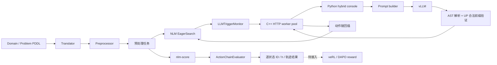

# NLM-CutPlan 改动重点与代码审阅指南

## 1. 文档目的

本文档面向需要审阅当前 NLM-CutPlan 分支的开发者和研究人员，回答以下问题：

1. 我们为什么修改原生 NLM；
2. 当前已经落地了哪些功能；
3. 一条在线 LLM 请求如何从 C++ 搜索器流向 Python/vLLM，再回到 Open List；
4. 强化学习轨迹评分接口复用了哪些 NLM 能力；
5. 审阅代码时应重点检查哪些语义、边界和性能风险；
6. 哪些内容仍只是设计，尚未实现。

本文以 `upstream/main` 的原生 NLM 为基线，描述当前 `main` 分支截至提交
`66446a7` 的主要变化。更详细的强化学习 reward 方案见
[reward_mechanism_design.md](reward_mechanism_design.md)。

## 2. 修改目标与边界

### 2.1 总体目标

项目希望在保留 NLM 原生状态转移、重复检测、启发式计算和 Open List 搜索的基础上，引入一个经过训练的 LLM：

- 在线求解时，LLM 从选定的中间状态生成一段候选动作链；
- Python 侧构造与训练阶段一致的 prompt，并验证模型输出的最长合法前缀；
- C++ 侧把合法前缀逐步应用，将产生的状态作为额外搜索分支加入 Open List；
- 强化学习时，独立的 NLM scorer 对模型动作轨迹进行状态转移和启发式评分。

### 2.2 保留的原生语义

以下核心语义仍由 NLM 负责：

- PDDL/SAS 任务翻译与预处理；
- `GlobalState` 和 `StateRegistry` 状态表示与去重；
- grounded operator 的适用性判断；
- 数值效果、逻辑公理和数值公理求值；
- 目标判断；
- 启发式计算；
- 搜索节点生命周期及 Open List 排序。

### 2.3 当前不做的事情

- 没有把 C++ 搜索主循环改成多线程并行搜索；
- 没有让 LLM 绕过 NLM 状态转移直接创建状态；
- 没有把 reward 权重和最终公式硬编码到 C++；
- 没有完成 veRL/Ray actor、scorer 池和训练侧 RewardManager；
- 没有保证 LLM 生成的动作链能改进启发式或一定到达目标。

## 3. 总体架构

当前形成了两条共享底层能力、但用途不同的链路。



两条链路共享：

- 预处理任务和 NLM 全局任务数据；
- operator 名称解析与适用性检查；
- `StateRegistry::get_successor_state()`；
- NLM 启发式和 `test_goal()`。

它们的主要区别是：

| 链路 | 起始状态 | 是否修改 Open List | 主要输出 |
|---|---|---:|---|
| 在线混合搜索 | 搜索过程中被触发的任意状态 | 是 | 新搜索分支 |
| 轨迹评分 | 当前实现固定从原问题初态开始 | 否 | JSONL 评分信号 |

## 4. 改动一：完整中间状态导出

### 4.1 原始问题

原生规划器内部不会把原始 `:init` 原样保存为一个完整 PDDL 集合：

- 动态命题进入 SAS/FDR 状态变量；
- 静态谓词可能在翻译阶段被消去；
- `weight`、`load_limit` 等静态数值函数不会作为普通动态变量保存；
- `fuel_cost` 等 instrumentation 数值与普通状态变量采用不同存储方式。

因此，简单遍历 `GlobalState` 只能得到参与动态状态编码的内容，不能保证获得 LLM 所需的完整世界状态。

### 4.2 新的数据传递路径

```text
原始 PDDL :init
  -> translator 识别静态 grounded 谓词和静态数值赋值
  -> 在 translator 输出中追加 begin_init_constant_facts
  -> preprocessor 原样透传
  -> search 读入 g_init_constant_facts
  -> 与当前 GlobalState 的动态事实和数值合并
  -> 完整 (:init ...)
```

关键文件：

- [grounded_static_facts.py](../src/translate/grounded_static_facts.py)：按 grounded fact 判断静态性；只要不存在可达 grounded action 的精确 delete effect，该初始事实就可以永久保留。
- [instantiate.py](../src/translate/instantiate.py)：把上述 grounded 静态事实并入 translator 已有的常量集合。
- [sas_tasks.py](../src/translate/sas_tasks.py)：把静态谓词和静态数值赋值序列化为 PDDL 风格文本；排除 translator 内部产生的对象相等事实。
- [helper_functions.cc](../src/preprocess/helper_functions.cc) 和 [preprocess/planner.cc](../src/preprocess/planner.cc)：在 preprocess 阶段读入并透传常量段。
- [globals.cc](../src/search/globals.cc) 和 [globals.h](../src/search/globals.h)：在 search 阶段保存为 `g_init_constant_facts`，并兼容没有该段的旧预处理输入。
- [global_state.cc](../src/search/global_state.cc)：实现 `GlobalState::get_pddl_init_string()`。

### 4.3 导出规则

`get_pddl_init_string()` 输出：

1. translator/preprocessor 透传的静态谓词和静态数值赋值；
2. 当前状态中所有取值不是 `<none of those>` 的动态命题；
3. 当前状态中的 `regular` 数值变量；
4. 当前状态中的 `instrumentation` 数值变量；
5. 去重后的完整 `(:init ...)` 外壳。

`constant` 数值由静态常量段提供，`derived` 数值由规划器内部按需计算，不作为独立初始赋值重复导出。

这里不是根据动作历史重放状态。某个事实即使在 50 步前产生、此后再无相关动作，只要它仍在当前 `GlobalState` 中为真，就会被导出。

### 4.4 调试探针

`EagerSearch` 中保留了按需状态探针 `probe_dump_pddl_init()`，用于审阅展开状态的完整 `:init`。它受探针总开关、输出上限和 stride 控制。

正式运行时，LLM 请求直接调用 `get_pddl_init_string()`；不需要常驻打印所有状态。关闭控制台全文输出后，主要开销只发生在真正发起请求的少量状态上。

## 5. 改动二：LLM 介入状态选择

触发逻辑集中在 [eager_search.cc](../src/search/search_engines/eager_search.cc) 的 `LLMTriggerMonitor`。

### 5.1 辅助 frontier

监控器不直接遍历或修改原 Open List，而是在状态正常计算出 `g/h` 并入队时维护一个按 `(f, h, g, insertion order, StateID)` 排序的辅助 `multiset`。

取样时通过 `SearchSpace` 检查节点是否仍为 open，以及缓存的 `g` 是否仍有效；过期记录采用 lazy deletion。这样避免每次触发都复制整个 Open List，但会额外占用与已记录 frontier 条目相关的内存。

### 5.2 三类正式触发条件

#### Frontier plateau

每经过 `NLM_LLM_CHECK_INTERVAL` 次扩展，查看辅助 frontier 前 `K` 个有效候选：

- 计算 `h` 的变异系数；
- 计算 `f = g + h` 的变异系数；
- 两者都低于各自阈值时，判定为 plateau。

同时检查 `h` 和 `f`，是为了避免把启发式相似、但路径代价层次差异很大的候选误认为同一平台。

#### Global stall

记录自上次出现“有意义的全局最佳 `h` 改善”以来的扩展次数。超过 `NLM_LLM_STALL_EXPANSIONS` 后触发。

“有意义的改善”采用：

```text
threshold = max(abs_epsilon,
                relative_epsilon * max(abs(old_h), abs(new_h)))
```

这避免不同问题的 `h` 量纲差异使绝对阈值失效。

#### Ancestor stagnation

节点从 Open List 弹出时，向上检查固定深度的父链。如果当前 `h` 相对这些祖先都没有超过上述混合阈值的改善，则为该节点触发请求。

### 5.3 批量选择与限流

- plateau/global-stall 检查一次最多提交 `NLM_LLM_BATCH_SIZE` 个候选；
- 每个 `StateID` 最多请求一次，`requested_states` 用于去重；
- `NLM_LLM_MAX_PENDING` 限制同时在途的状态数，`0` 表示不在 C++ 侧设上限；
- 已 pending 或已请求的状态不会再次进入候选 batch；
- `NLM_LLM_REQUEST_INITIAL` 是联调入口，可强制请求初始状态，不属于三类正式触发器。

## 6. 改动三：异步 C++/Python 通信

### 6.1 C++ bridge

`LLMBridge` 位于 [eager_search.cc](../src/search/search_engines/eager_search.cc)，是搜索线程与 Python 控制台之间的边界。

- 搜索线程只调用 `submit()` 和 `poll_completed()`；
- 后台 worker 线程负责阻塞式 HTTP connect/send/recv；
- 多个 worker 可同时等待多个 Python/vLLM 请求；
- outgoing queue 可配置上限；
- 搜索结束时会停止队列、关闭活动 socket 并 join worker；
- 当前真实 HTTP socket 实现仅支持 POSIX/WSL/Linux，Windows 原生构建返回明确错误。

worker 在网络等待期间通常不持续消耗 CPU；提高并发数的主要成本是线程栈、连接对象、日志和 Python 侧后续工作，而不是持续占满 CPU。

### 6.2 在线请求协议

C++ 发给 Python 的 HTTP JSON 包含：

```json
{
  "type": "llm_request",
  "request_id": "123-7",
  "state_id": 123,
  "state_label": "#123",
  "problem_id": "problem_scale_10_id_1",
  "reason": "frontier_plateau",
  "g": 4,
  "h": 7,
  "init": "(:init\n  ...\n)\n"
}
```

其中真正用于 Python 构造 prompt 的核心字段是 `problem_id` 和 `init`；其他字段用于关联响应、诊断和实验统计。

Python 返回：

```json
{
  "type": "llm_response",
  "request_id": "123-7",
  "state_id": 123,
  "status": "partial",
  "actions": [
    "(lift hoist0 crate1 pallet0 depot0)",
    "(load hoist0 crate1 truck0 depot0)"
  ],
  "generated_action_count": 4,
  "legal_action_count": 2,
  "invalid_action_index": 2,
  "goal_reached": false
}
```

HTTP 2xx 只表示通信成功；`status` 表达 prompt、模型、解析和验证层面的结果。C++ 当前只对 `ok` 和 `partial` 状态中的非空动作链执行回插。

### 6.3 Pending 语义

监控器维护：

- `pending_states`：请求已提交且尚未返回；
- `suspended_states`：在 `skip` 模式下，pending 状态已经从 Open List 弹出并被暂时移走；
- `requested_states`：整个搜索期间已经请求过的状态。

两种策略：

| 策略 | 源状态等待期间 | 响应完成后 |
|---|---|---|
| `normal` | 源状态仍可正常扩展 | 只处理可用的 LLM 动作链 |
| `skip` | 源状态弹出时不 close、不扩展，记录为 suspended | 无论响应成功与否都重新入队；合法动作链作为额外分支加入 |

如果 Open List 已空但仍有 pending 请求，搜索线程以 10 ms 间隔等待响应，而不会过早宣布搜索失败。

## 7. 改动四：Python 控制台、prompt 与模型回复处理

Python 控制面位于 [hybrid_planner](../hybrid_planner/)。

### 7.1 生命周期编排

[console.py](../hybrid_planner/console.py) 负责：

1. 校验 prompt 所需资源；
2. 在 live 模式下启动或连接 vLLM，并等待 `/v1/models` ready；
3. 启动并发 HTTP server；
4. 配置环境变量并启动 C++ planner；
5. 处理来自 C++ 的状态请求；
6. planner 结束后关闭 HTTP server、异步模型 runtime 和自管 vLLM。

`ThreadingHTTPServer` 允许多个 C++ 请求同时进入。prompt 翻译和 UP 验证分别用有界 semaphore 控制 CPU 并发；模型调用由一个后台 asyncio event loop 和共享 `aiohttp` connection pool 处理，其并发上限与 CPU worker 数相互独立。

### 7.2 Prompt 构造

[builder.py](../hybrid_planner/prompting/builder.py) 接收 `problem_id + runtime init`：

1. 根据 `problem_id` 读取原始 problem PDDL；
2. 只替换原 problem 的 `:init`，保留 objects、goal 和 metric；
3. 用迁入项目的同版 PDDL translator 生成训练格式的 problem description；
4. 读取对应 domain 的无 assert 说明；
5. 组合 system/user messages。

该实现刻意保留了“以原始问题为模板、覆盖运行时初态”的步骤。虽然 C++ 已输出完整 `:init`，原 problem 仍负责提供对象声明、目标、metric 以及问题级结构。

### 7.3 模型输出解析和合法前缀

[response_processor.py](../hybrid_planner/validation/response_processor.py) 的处理顺序是：

1. 取最长 Python fenced code block，若无代码块则使用完整回复；
2. 使用 Python AST 解析，不执行模型生成代码；
3. 只接受顶层、顺序出现的 `action_Xxx(...)` 调用；
4. 参数只允许普通名称或字符串常量，不允许计算表达式和关键字参数；
5. 把 `action_PickUp(...)` 转成 `(pick-up ...)` 风格的 PDDL grounded action；
6. 用 Unified Planning 从运行时初态逐步模拟；
7. 遇到未知对象、未知动作或不可应用动作时截断；
8. 一旦到达目标就停止，忽略目标之后的冗余动作；
9. 只把最长合法、且不越过第一个目标状态的前缀返回 C++。

Python 是在线链路的主要格式和合法性验证层。C++ 回插时仍会重新做 operator 名称解析和 `is_applicable()` 检查，这是针对协议错误和实现不一致的防御性保护，不应理解为完整重复运行 UP 验证。

### 7.4 运行模式

- `mock`：只构造 prompt，不调用模型；
- `replay`：使用保存好的固定模型回复，验证完整解析和回插链路；
- `live`：启动或连接 vLLM，执行真实并发推理。

## 8. 改动五：LLM 动作链回插 Open List

回插实现位于 `EagerSearch::inject_llm_action_chain()`，底层动作解析和状态转移已抽取到
[action_chain_evaluator.cc](../src/search/action_chain_evaluator.cc)。

每个动作依次执行：

1. 统一空白、括号和大小写后查找 grounded `GlobalOperator`；
2. 在当前状态检查动作适用性；
3. 检查路径 bound 和 dead-end 状态；
4. 调用 `StateRegistry::get_successor_state()` 应用原生状态转移并去重；
5. 调用各启发式的 `reach_state()`；
6. 对新状态计算启发式并创建 `SearchNode`；
7. 把状态插入原生 Open List；
8. 若状态已存在但发现更低 `g`，按原搜索配置执行 reopen 或更新 parent；
9. 继续从该后继执行下一动作。

重要语义：

- LLM “跳步”仍会显式产生和注册每一个中间状态；
- 它减少的是这些中间步骤周围的分支扩展，不是绕过规划器状态模型；
- LLM 产生的状态与普通搜索状态进入同一 `StateRegistry`，因此共享原生重复检测；
- 合法链中的目标状态先进入 Open List，之后被正常弹出时由原搜索循环确认目标并回溯计划；
- 即使 LLM 前缀无效，`skip` 模式也会恢复原源状态，保留 classical fallback。

## 9. 改动六：强化学习轨迹评分接口

这部分用于后续 veRL/DAPO 训练，与在线 HTTP bridge 相互独立。

### 9.1 共享动作链求值器

[action_chain_evaluator.h](../src/search/action_chain_evaluator.h) 提供：

- `normalize_operator_name()`：统一 grounded action 字符串；
- `resolve_action()`：动作查找和适用性检查；
- `apply_action()`：调用原生状态注册器产生后继；
- `evaluate()`：从初态逐步执行动作、计算每个状态的启发式并判断目标。

在线回插复用前三个 step-level 方法，再自行处理 SearchNode/Open List 副作用；独立 scorer 调用 `evaluate()`，不接触 Open List。

### 9.2 `nlm-score` 入口

[trajectory_scorer_main.cc](../src/search/trajectory_scorer_main.cc) 为同一个 `downward` 二进制增加两种调用方式：

```text
nlm-score --task <preprocessed-task> --once
nlm-score --task <preprocessed-task> --stream
```

CMake 构建后把 `downward` 复制为 `nlm-score`；程序根据可执行文件名或 `--trajectory-scorer` 选择 scorer 入口。这样可以共享完整任务加载和 heuristic plugin 集合，不需要编译第二套 planner 核心。

`--once` 处理一个 JSONL 请求后退出；`--stream` 完成任务和启发式 warmup 后发送 `ready`，随后串行处理多个请求。

### 9.3 JSONL 协议

请求最小结构：

```json
{
  "type": "score_request",
  "protocol_version": 1,
  "request_id": "rollout-123",
  "problem_id": "problem_scale_10_id_1",
  "task_hash": "sas-sha256:...",
  "actions": ["(lift ...)", "(load ...)"]
}
```

响应当前包含：

```json
{
  "type": "score_response",
  "protocol_version": 1,
  "request_id": "rollout-123",
  "problem_id": "problem_scale_10_id_1",
  "task_hash": "sas-sha256:...",
  "status": "ok",
  "outcome": "legal_incomplete",
  "generated_action_count": 2,
  "applied_action_count": 2,
  "invalid_action_index": null,
  "path_cost": 2,
  "registered_state_count": 17,
  "scorer_seconds": 0.01,
  "recycle_recommended": false,
  "recycle_reason": null,
  "error": null,
  "states": [
    {"state_index": 0, "state_id": 0, "h": 8},
    {"state_index": 1, "state_id": 4, "h": 7}
  ]
}
```

`states` 总是先记录初态，再记录每个成功应用动作产生的状态，因此正常情况下：

```text
len(states) = applied_action_count + 1
```

启发式为 infinity 时，对应 `h` 序列化为 `null`。当前 outcome 为：

- `goal_reached`：初态或某个合法前缀状态满足目标；
- `invalid`：遇到未知或不可应用动作；
- `legal_incomplete`：动作全部合法但没有到达目标。

### 9.4 Task hash 与进程回收

scorer 默认计算整个预处理任务文件的 SHA-256，格式为 `sas-sha256:<digest>`。它用于：

- 标识加载的具体任务内容；
- 防止请求被发给错误问题的 scorer；
- 作为 Python/Ray 侧缓存和路由键；
- 判断缓存更新后是否应回收旧 scorer。

stream 进程可在以下情况建议调用方回收：

- 单请求评分超时；
- 已处理请求数达到上限；
- `StateRegistry` 注册状态数达到上限。

### 9.5 已实现与未实现边界

已经实现：

- C++ `--once/--stream` scorer；
- JSONL 解析、ready/response/shutdown 协议；
- task hash 防错配；
- 动作合法前缀、目标、路径代价和逐状态 `h`；
- scorer 超时和有界回收信号；
- 集成测试。

尚未实现：

- veRL `RewardManager.run_single()` 适配；
- Ray scorer actor pool 和基于 `task_hash` 的 LRU 进程管理；
- 从模型完整回复提取动作后调用 scorer 的训练侧客户端；
- 合法前缀、目标、重复状态和启发式进展的最终 reward 组合；
- `reward_extra_info` 回传；
- 独立的 per-state repeat/new-best/delta-h 字段。

当前 `states` 中的重复状态可以由同一响应内重复出现的 `state_id` 推导，但不能使用“是否第一次进入长期 `StateRegistry`”作为 reward，因为这会使奖励依赖请求顺序。

## 10. 并发和性能语义

### 10.1 在线搜索

当前 C++ 搜索主循环仍是单线程：一次只执行一个 `remove_min -> close -> expand`。并发发生在：

```text
C++ 单线程搜索 || C++ HTTP workers || Python 请求线程 || vLLM 并发推理
```

因此，LLM 等待期间搜索器可以继续扩展非 pending 状态，但不是多个 C++ 线程同时扩展 Open List。

### 10.2 Python 并发层次

- HTTP server：并发接收 C++ 请求；
- prompt workers：限制 PDDL 翻译并发；
- validation workers：限制 Unified Planning 模拟并发；
- LLM max concurrency：限制向 vLLM 的并发请求数；
- C++ HTTP workers：限制 C++ 同时等待的 HTTP 连接数。

这些上限用途不同，不能简单设置成同一个数。vLLM 并发可以较高，而 prompt/UP 并发应根据搜索器 CPU 竞争情况保守设置。

### 10.3 时间统计注意事项

Linux 下 NLM 的原生 `utils::Timer` 使用 `CLOCK_PROCESS_CPUTIME_ID`。日志中的 `Actual search time` 主要反映 C++ 进程 CPU 时间，不等于包含 vLLM 等待的端到端 wall-clock 时间。

论文实验应分别记录：

- Python 启动到计划产生的 wall-clock；
- C++ search CPU time；
- expanded/generated/evaluated 状态数；
- LLM 请求数、延迟、合法前缀长度和命中目标数；
- pending 期间扩展数和实际阻塞等待时间；
- LLM 回插的新状态数、重复状态数与最终 plan cost。

## 11. 主要配置入口

生产默认值由 [console.py](../hybrid_planner/console.py) 和 `LLMTriggerMonitor::Config` 共同决定；
[run_probe_test_wsl.sh](../scripts/run_probe_test_wsl.sh) 为了容易触发机制，使用了明显更激进的调试值，不能直接作为正式实验配置。

| 配置 | 作用 | C++ 默认 |
|---|---|---:|
| `NLM_LLM_TRIGGER` | LLM 触发总开关 | 关闭 |
| `NLM_LLM_PENDING_BEHAVIOR` | `normal` 或 `skip` | 非 `skip` 即 normal |
| `NLM_LLM_FRONTIER_K` | plateau 检查的前 K 个候选 | 64 |
| `NLM_LLM_BATCH_SIZE` | 单次 frontier 检查最多请求数 | 1 |
| `NLM_LLM_CHECK_INTERVAL` | frontier/global stall 检查间隔 | 100000 expansions |
| `NLM_LLM_STALL_EXPANSIONS` | 全局最佳 h 停滞阈值 | 500000 |
| `NLM_LLM_ANCESTOR_CHECK_INTERVAL` | 父链停滞检查间隔 | 100000 expansions |
| `NLM_LLM_ANCESTOR_DEPTH` | 父链停滞检查深度 | 10 |
| `NLM_LLM_MIN_DEPTH` | 允许父链触发的最小深度 | 20 |
| `NLM_LLM_MAX_PENDING` | 最大在途状态数，0 为无限制 | 0 |
| `NLM_LLM_H_EPSILON` | h 比较绝对兜底阈值 | 0.001 |
| `NLM_LLM_H_RELATIVE_EPSILON` | h 相对改善阈值 | 0.005 |
| `NLM_LLM_PLATEAU_H_CV` | h 变异系数阈值 | 0.03 |
| `NLM_LLM_PLATEAU_F_CV` | f 变异系数阈值 | 0.03 |
| `NLM_LLM_HTTP_WORKERS` | C++ HTTP worker 数 | 8 |
| `NLM_LLM_HTTP_MAX_QUEUE` | C++ outgoing queue 上限，0 为无限制 | 0 |
| `NLM_LLM_EMIT_STATE` | 是否把完整 init 打到日志 | 关闭 |

Python 控制台启动时会显式打开 trigger，并根据 HTTP worker/模型并发设置默认 pending 上限。正式实验必须保存所有实际环境变量和命令行参数，而不是只记录脚本名。

## 12. 构建、脚本和仓库整理

新增的主要入口：

- [compile_linux.sh](../scripts/compile_linux.sh)：Linux 容器编译；
- [compile_windows_source_wsl.sh](../scripts/compile_windows_source_wsl.sh)：Windows 文件系统上的 WSL 编译；
- [run_hybrid_live_linux.sh](../scripts/run_hybrid_live_linux.sh)：Linux GPU 容器完整 live 测试；
- [run_hybrid_live_wsl.sh](../scripts/run_hybrid_live_wsl.sh)：WSL live 模式；
- [run_hybrid_replay_wsl.sh](../scripts/run_hybrid_replay_wsl.sh)：确定性 replay；
- [run_probe_test_wsl.sh](../scripts/run_probe_test_wsl.sh)：触发器和状态探针调试。

仓库层面还完成了：

- 把 Python 控制面按 `llm/prompting/validation` 职责整理到 `hybrid_planner/`；
- 把脚本集中到 `scripts/`，依赖集中到 `requirements/`；
- 从 Git 中移除 build tree、运行输出、prompt debug、PPT 导出和 Bliss 编译产物；
- 用 `.gitignore` 防止上述产物再次进入版本控制；
- 用 `.gitattributes` 固定 shell/Python 文本为 LF，减少 WSL/Linux 换行问题。

## 13. 测试覆盖

### 13.1 Python 单元测试

测试目录 [tests](../tests/) 覆盖：

- grounded 静态事实识别；
- 静态数值赋值序列化和对象等式过滤；
- runtime init 替换和 prompt 构造；
- AST 动作提取及命名转换；
- UP 最长合法前缀和到达目标后截断；
- HTTP handler 返回协议；
- 异步 LLM client、重试和并发；
- vLLM 命令构造、ready 检测和生命周期；
- console 环境变量默认值。

### 13.2 C++ scorer 集成测试

[test_trajectory_scorer.py](../tests/test_trajectory_scorer.py) 需要已编译的 `nlm-score` 和 fixture 预处理任务，覆盖：

- `--once` 合法但未完成轨迹；
- 到达目标后忽略尾随动作；
- `--stream` ready、错误恢复、task mismatch 和 shutdown；
- 非法动作的最长合法前缀；
- 基本响应字段和状态序列。

### 13.3 手工端到端验证

已有三种可重复检查路径：

1. probe：只观察触发和完整中间状态；
2. replay：固定回复走完整 prompt、UP 验证、HTTP 和 Open List 回插；
3. live：真实启动 vLLM，并从初始状态生成、验证和回插动作链。

## 14. 建议的代码审阅顺序

### 第一轮：状态语义

1. [grounded_static_facts.py](../src/translate/grounded_static_facts.py)
2. [sas_tasks.py](../src/translate/sas_tasks.py)
3. [helper_functions.cc](../src/preprocess/helper_functions.cc)
4. [globals.cc](../src/search/globals.cc)
5. `GlobalState::get_pddl_init_string()`

重点确认：静态事实没有漏项、内部等式没有误导出、动态事实不会被静态副本覆盖、旧任务格式仍可读取。

### 第二轮：搜索行为

1. `LLMTriggerMonitor::record_open_state()`
2. `frontier_plateau()` / `ancestor_stagnant()`
3. `request_state()` / `suspend_if_pending()`
4. `EagerSearch::fetch_next_node()`
5. `poll_llm_responses()` / `requeue_llm_source()`
6. `inject_llm_action_chain()`

重点确认：pending 状态未被 close、失败响应一定恢复 suspended source、重复响应不会重复请求、回插状态沿用原搜索 reopen/bound/dead-end 语义。

### 第三轮：并发与生命周期

1. C++ `LLMBridge` 的 queue、active request 和 stop；
2. Python `ThreadingHTTPServer`；
3. `BackgroundLLMRuntime` 的 event loop；
4. prompt/validation semaphore；
5. planner 提前结束后的 BrokenPipe 处理和 debug 文件落盘。

重点确认：没有搜索线程中的阻塞 HTTP、关闭流程不会遗留线程/socket、请求与响应始终依靠 `request_id/state_id` 正确关联。

### 第四轮：训练 scorer

1. [action_chain_evaluator.cc](../src/search/action_chain_evaluator.cc)
2. [trajectory_score_protocol.cc](../src/search/trajectory_score_protocol.cc)
3. [trajectory_scorer_main.cc](../src/search/trajectory_scorer_main.cc)
4. [test_trajectory_scorer.py](../tests/test_trajectory_scorer.py)

重点确认：scorer 不修改 Open List、每次请求从原始初态开始、目标后尾随动作被忽略、长期 registry 状态不进入 reward 语义、超时和回收不会生成伪造的正常结果。

## 15. 已知限制与后续风险

1. `eager_search.cc` 当前同时容纳 HTTP、JSON 响应解析、触发器和回插逻辑，文件较大；功能稳定后可按职责拆分，但不宜在实验前做无关重构。
2. C++ 在线 HTTP bridge 是简单 HTTP/1.1 + connection-close 实现，没有连接复用、TLS 和 chunked response 支持，定位是本机 Python 控制台通信。
3. 在线动作链先经 UP 验证，再经 NLM 防御性检查。两个语义引擎必须通过领域测试保持一致；出现分歧时以 NLM 实际可应用结果为准。
4. auxiliary frontier 会保留 stale 条目直到采样时清理。困难问题上需要监控其内存增长，并考虑周期性压缩。
5. `requested_states` 当前在一次搜索中不回收，保证每状态最多请求一次，但也会随请求数增长。
6. `skip` 模式会改变原生搜索顺序；LLM 高延迟或低质量时可能让搜索器扩展更多次优节点。论文必须同时报告 wall time 和节点统计。
7. scorer 当前把 unknown action 和 inapplicable action 都汇总为 `outcome=invalid`，如 reward 需要区分，应扩展协议。
8. scorer 当前逐状态只返回 `state_index/state_id/h`；重复标记、`delta_h`、best-h 等仍应在协议或 Python 层补充。
9. `StateID` 只在对应任务和 scorer 进程内有意义，不能跨任务或跨进程比较。
10. `--task-hash` 显式传入时当前实现直接采用该值，不重新核验文件内容；生产缓存构建器必须保证其来源可信，或后续增加强校验模式。
11. reward 设计中的 Ray actor、LRU scorer pool、veRL 接口和 reward 公式尚未落地，不能把 C++ scorer 测试通过表述为“强化学习链路已经完成”。
12. 在线主搜索仍为单线程；LLM 并发隐藏的是推理等待，不是把 NLM 节点扩展本身并行化。

## 16. 审阅结论应回答的问题

完成审阅后，建议至少明确回答：

- 中间状态 `:init` 是否对目标领域完整且可被原 PDDL parser 重新读取？
- 三类触发器是否选择了预期状态，额外 bookkeeping 是否可接受？
- `normal/skip` 两种 pending 策略是否都保留 classical fallback？
- 并发请求在 planner 提前结束、超时、失败和乱序返回时是否安全？
- Python 解析和 UP 验证是否严格匹配训练输出格式？
- C++ 回插是否正确复用状态去重、启发式、bound、dead-end 和 reopen 逻辑？
- scorer 对相同任务和相同动作序列是否给出确定、顺序无关的原始信号？
- 论文统计是否区分端到端 wall time、C++ CPU time、常规扩展和 LLM 路径推进？
- 当前未实现项是否在实验声明中被准确排除？

## 17. 相关文档

- [README.md](../README.md)：构建、mock/replay/live 使用方式；
- [reward_mechanism_design.md](reward_mechanism_design.md)：veRL/DAPO reward 机制详细设计；
- [requirements/hybrid.txt](../requirements/hybrid.txt)：Python 运行时依赖；
- [scripts](../scripts/)：编译、探针和端到端运行入口。
